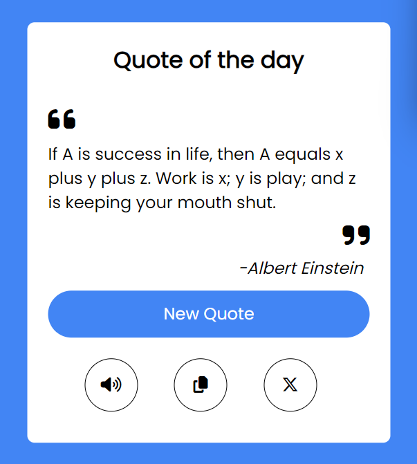

# Quote Generator

This simple web application generates random quotes fetched from the [Quotable API](https://api.quotable.io/random) and allows users to interact with the quotes by copying, listening, and sharing them on Twitter.

## Preview

## Technologies Used
- HTML
- CSS
- JavaScript

## Features

- **Random Quote Generation:** Clicking the "New Quote" button fetches a new random quote and displays it.
- **Copy Quote:** Allows users to copy the displayed quote to their clipboard.
- **Text-to-Speech:** Clicking the speaker icon reads out the quote and its author.
- **Share on Twitter:** Share the quote and its author on Twitter.

## Installation

1. Clone this repository.
2. Open `index.html` in your web browser.

## How to Use

- Click the "New Quote" button to generate a new random quote.
- Click the copy button to copy the quote to your clipboard.
- Click the speaker icon to listen to the quote and its author.
- Share the quote on Twitter by clicking the Twitter icon.

## Project Structure

- `index.html`: Contains the structure and layout of the web app.
- `style.css`: Stylesheet for the HTML elements.
- `script.js`: JavaScript file for handling interactions and fetching quotes from the Quotable API.

## How to Contribute

If you'd like to contribute to this project, feel free to fork the repository, make changes, and submit a pull request.

## Acknowledgments

- Thanks to the [Quotable API](https://api.quotable.io/random) for providing the quotes.

## License

This project is licensed under the MIT License - see the [LICENSE](LICENSE) file for details.