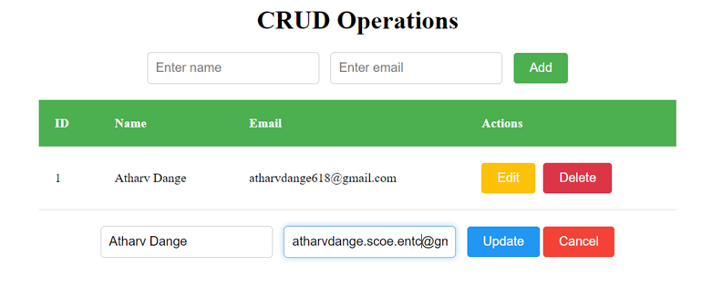

# CRUD Operations using Vanilla JavaScript

This project implements Create, Read, Update, and Delete (CRUD) operations for managing user data.

## Interface

## Overview

The application provides a user interface to:

- Add new users with their name and email.
- View the list of users in a table format.
- Update existing user information.
- Delete users from the list.

## Technologies Used

- **HTML**: Structure and layout of the application.
- **CSS**: Styling for the user interface.
- **JavaScript**: Functionality and logic for CRUD operations.
- **LocalStorage**: Storage mechanism to persist user data locally in the browser.

## Application Features

### Adding a User

- Enter the user's name and email in the input fields.
- Click the "Add" button to add a new user to the list.

### Viewing Users

- Users are displayed in a table format with columns: ID, Name, Email, and Actions.
- Each row includes "Edit" and "Delete" buttons.

### Editing User Information

- Click the "Edit" button to modify user details.
- Update the name or email of the selected user.
- Click the "Update" button to save changes or "Cancel" to discard changes.

### Deleting a User

- Click the "Delete" button to remove a user from the list permanently.

## Getting Started

1. Open the `index.html` file in a web browser.
2. Interact with the input fields and buttons to perform CRUD operations.

## Notes

- The application uses LocalStorage to store user data persistently in the browser.
- Email validation is implemented using a regular expression.
- Users are displayed in a table, allowing easy access to manage user details.

## Contact

If you have any questions or suggestions, please feel free to contact me:

- Email: atharvdange.dev@gmail.com
- LinkedIn: [Atharv Dange](http://linkedin.com/in/atharvdange)
- Twitter: [@atharvdangedev](https://twitter.com/atharvdangedev)