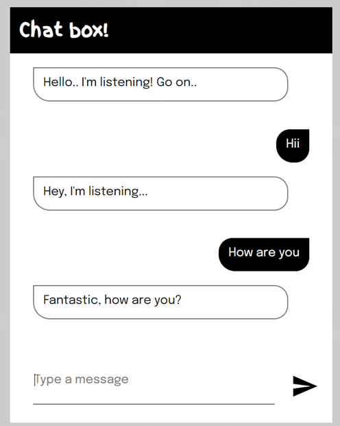

# Chat Box

This project implements a simple chatbot interface where users can interact by sending messages and receiving responses from the bot.

## Interface

## Overview

The chat box provides a basic conversational experience allowing users to type messages and get replies from the bot.

## Features

- **Message Input**: Users can input messages in the provided text field.
- **Bot Response**: The bot provides responses based on predefined messages.
- **Voice Output**: Responses from the bot are converted to speech using the `SpeechSynthesisUtterance`.

## Usage

1. Open `index.html` in a web browser.
2. Type a message in the input field and press "Enter" or click the send button.
3. The bot will respond based on predefined messages.
4. Both user and bot messages are displayed in the message section.

## Implementation

- **Message Handling**: User input is processed and compared with predefined arrays to generate bot responses.
- **Voice Synthesis**: The `SpeechSynthesisUtterance` API is used to convert text responses to speech.

## Styles

- The interface utilizes CSS to create a chat box layout with distinct user and bot message styling.
- The chat messages are displayed in a conversational format, providing a clear distinction between user and bot messages.

## Notes

- This is a simple demonstration of a chatbot interface using predefined responses.
- The bot's responses are based on specific trigger words and phrases present in the user input.

