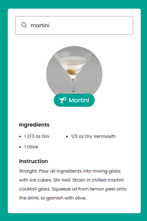

# Cocktail Recipe App

This web application enables users to search for cocktail recipes based on their names. It utilizes the [TheCocktailDB API](https://www.thecocktaildb.com/api.php) to fetch cocktail details and display the recipe information.

## Preview

## Live Demo link https://cocktailreceipe.netlify.app/

## Technologies Used
- HTML
- CSS
- JavaScript

## Features

- **Search Cocktails:** Enter the name of a cocktail to search for its recipe.
- **Display Recipe:** Displays the cocktail's image, name, ingredients, and instructions.
- **Dynamic Ingredients List:** Lists all the ingredients and their measures required for the cocktail.
- **User-Friendly Interface:** Easy-to-use interface for searching and viewing cocktail recipes.

## Installation

1. Clone this repository.
2. Open `index.html` in your web browser.

## How to Use

- Type the name of the cocktail you want to search for in the input box.
- Press "Enter" to display the cocktail's recipe.
- View the cocktail's image, name, list of ingredients, and instructions.

## Project Structure

- `index.html`: Contains the structure and layout of the web app.
- `Cocktail.css`: Stylesheet for the HTML elements.
- `Cocktail.js`: JavaScript file responsible for handling user input, fetching data from the API, and displaying the cocktail information.

## How to Contribute

If you'd like to contribute to this project, feel free to fork the repository, make changes, and submit a pull request.

## Acknowledgments

- Thanks to [TheCocktailDB API](https://www.thecocktaildb.com/api.php) for providing cocktail data.

## License

This project is licensed under the MIT License - see the [LICENSE](LICENSE) file for details.
