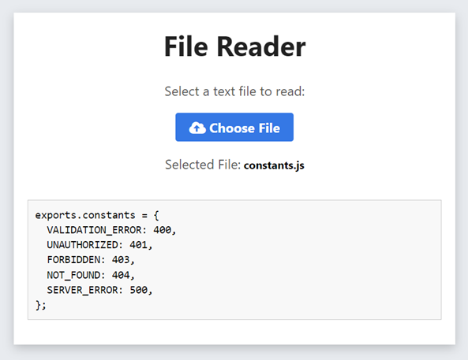

# JavaScript FileReader

This project demonstrates how to read and display the content of a text file using JavaScript FileReader.

## Interface

## Overview

The application allows users to select a text file and view its contents within the web browser.

## Features

- **File Selection**: Choose a text file using the file input button.
- **File Display**: Display the selected file's content in a preformatted text area.
- **Supported File Types**: Accepts `.txt`, `.md`, `.html`, `.css`, and `.js` file formats.

## Usage

1. Open the `index.html` file in a web browser.
2. Click on the "Choose File" button.
3. Select a text file from your local storage.
4. The selected file's name will be displayed.
5. The content of the file will be displayed in the preformatted text area.

## File Input

- The application uses an input field of type `file` to choose a text file.
- Once a file is selected, the name of the chosen file is displayed.

## File Reading

- The FileReader API is utilized to read the contents of the selected text file.
- If the file format is not a valid text file (not `.txt`, `.md`, `.html`, `.css`, or `.js`), an alert is shown.

## Styles

- The application layout and styles are set using HTML and CSS for a user-friendly interface.
- The file's content is displayed in a preformatted text area with appropriate styling.

## Notes

- Ensure the selected file is a text file with one of the supported extensions.
- The FileReader API is used to read the content of the selected file and display it on the webpage.

## Contact

If you have any questions or suggestions, please feel free to contact me:

- Email: atharvdange.dev@gmail.com
- LinkedIn: [Atharv Dange](http://linkedin.com/in/atharvdange)
- Twitter: [@atharvdangedev](https://twitter.com/atharvdangedev)