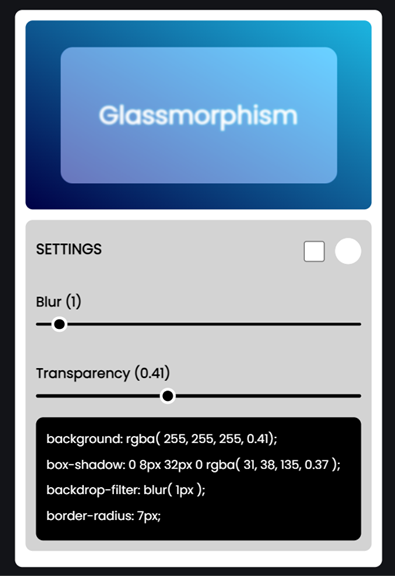

# Glassmorphism Generator

The Glassmorphism Generator is a tool to create glassmorphic UI elements. It allows users to customize and generate glassmorphic effects by adjusting parameters like color, blur, and transparency.

## Preview

## Technologies Used
- HTML
- CSS
- JavaScript

## Features

- **Color Customization:** Change the glass color using the color picker.
- **Blur and Transparency Adjustment:** Modify blur and transparency levels for the glass effect.
- **Outline Option:** Toggle an outline around the glass element for better visibility.
- **Real-time Code Output:** Displays CSS code snippets for generating the glassmorphism effect.

## Usage

1. Open `index.html` in a web browser.
2. Use the color picker to select a color for the glass element.
3. Adjust the blur and transparency sliders to customize the glass effect.
4. Check the outline option for an additional border around the glass element.
5. Copy the CSS code snippets displayed for implementing the glassmorphism effect in your project.

## Project Structure

- `index.html`: Contains the structure and layout of the Glassmorphism Generator tool.
- `style.css`: Stylesheet for the HTML elements.
- `script.js`: JavaScript file handling user interactions and generating the glassmorphism effect.

## Notes

- Ensure that the `script.js` file is linked correctly to the HTML file.
- Customize the code output section to match the desired CSS format or additional styles.

## How to Contribute

If you'd like to contribute to this project, feel free to fork the repository, make changes, and submit a pull request.

## Contact

If you have any questions or suggestions, please feel free to contact me:

- Email: atharvdange.dev@gmail.com
- LinkedIn: [Atharv Dange](http://linkedin.com/in/atharvdange)
- Twitter: [@atharvdangedev](https://twitter.com/atharvdangedev)