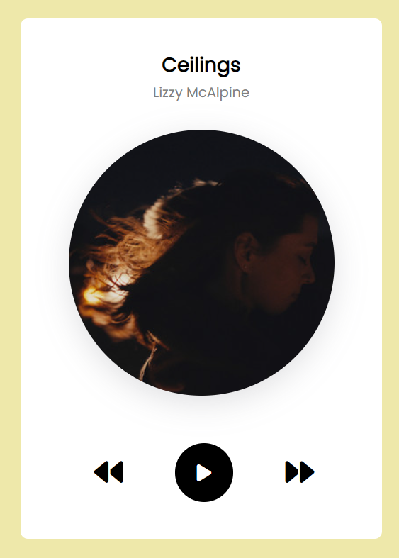

# Music Player

This web-based music player allows users to listen to a collection of songs. It provides basic functionalities like playing, pausing, skipping to the next and previous tracks, and displays the music details such as title, artist, and album art.

## Preview

## Technologies Used
- HTML
- CSS
- JavaScript

## Features

- **Play and Pause:** Allows users to play and pause music.
- **Next and Previous Track:** Navigate between tracks using next and previous buttons.
- **Dynamic Music Details:** Displays music title, artist, and album art dynamically.
- **User-Friendly Interface:** Simple interface for an intuitive music listening experience.

## Usage

1. Open `index.html` in a web browser.
2. Click on the play button to start playing the initial track.
3. Use the next and previous buttons to navigate between tracks.
4. Pause and play the music using the play/pause button.

## Project Structure

- `index.html`: Contains the structure and layout of the music player.
- `style.css`: Stylesheet for the HTML elements.
- `script.js`: JavaScript file responsible for handling music playback and interaction.

## Notes

- Ensure all music files are available and properly linked in the project directory.
- Add more music tracks to the `allmusic` array in the `Data.js` file to expand the collection.

## How to Contribute

If you'd like to contribute to this project, feel free to fork the repository, make changes, and submit a pull request.

## Contact

If you have any questions or suggestions, please feel free to contact me:

- Email: atharvdange.dev@gmail.com
- LinkedIn: [Atharv Dange](http://linkedin.com/in/atharvdange)
- Twitter: [@atharvdangedev](https://twitter.com/atharvdangedev)