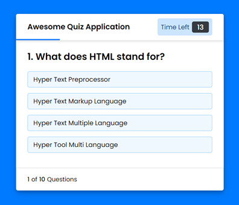

# Quiz Application with Timer

A quiz application with a timer, built using HTML, CSS, and JavaScript.

## Table of Contents

- [Description](#description)
- [Features](#features)
- [Demo](#demo)
- [Installation](#installation)
- [Usage](#usage)
- [Contributing](#contributing)
- [License](#license)

## Description

This project is a simple quiz application with a timer. It provides users with a set of questions, each with a time limit for answering. The application keeps track of the user's score and displays it at the end of the quiz. It also enforces rules such as a time limit for each question and not allowing changes once an answer is selected.

## Features

- Timer for each question (15 seconds per question).
- Prevents changing answers after selection.
- Automatic progression to the next question.
- Score calculation based on correct answers.

## Demo

[See the live demo here](https://quiz-application-by-atharv.netlify.app/)

## Installation

To run this project locally, follow these steps:

1. Clone the repository: `git clone https://github.com/atharvdange618/webd.git`
2. Navigate to the project directory: `cd Quiz Application with Timer`
3. Open `index.html` in a web browser to use the application.

## Usage

1. Click the "Start Quiz" button to begin.
2. Read the rules presented in the info box and click "Continue" to start the quiz.
3. Answer each question within the time limit.
4. The application will automatically move to the next question or display the result.
5. After completing all questions, your score will be displayed in the result box.
6. You can choose to replay the quiz or quit.

## Contributing

Contributions are welcome! If you'd like to contribute to this project, please follow these steps:

1. Fork the repository.
2. Create a new branch: `git checkout -b feature/new-feature`
3. Make your changes and commit them: `git commit -m "Add new feature"`
4. Push to the branch: `git push origin feature/new-feature`
5. Create a pull request.

## Contact

If you have any questions or suggestions, please feel free to contact me:

- Email: atharvdange.dev@gmail.com
- LinkedIn: [Atharv Dange](http://linkedin.com/in/atharvdange)
- Twitter: [@atharvdangedev](https://twitter.com/atharvdangedev)