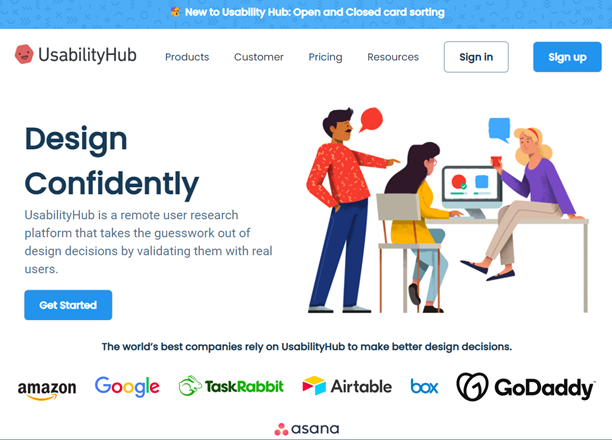

# CSS Usability Hub Clone

A CSS-based clone of the Usability Hub website, demonstrating web development skills.

## Table of Contents

- [Description](#description)
- [Features](#features)
- [Technologies Used](#technologies-used)
- [Installation](#installation)
- [Usage](#usage)
- [Contributing](#contributing)
- [License](#license)

## Description

This project is a CSS-based clone of the Usability Hub website, a remote user research platform. It closely replicates the design and layout of the original site to showcase the use of HTML and CSS for web development.

## Features

- Responsive layout for various screen sizes
- CSS styling mimicking Usability Hub's visual design
- Companies Section
- Features Section
- Big Features Section
- Examples Section
- Call to Action Section

## Technologies Used

- HTML
- CSS

## Installation

To run this project locally, follow these steps:

1. Clone the repository: `git clone https://github.com/atharvdange618/webd/tree/main/Beginner%20Projects/Usability%20Hub%20Clone`
2. Navigate to the project directory: `cd Usability-Hub-Clone`
3. Open `index.html` in a web browser to view the clone.

## Usage

Once the project is open in a web browser, you'll see the cloned Usability Hub homepage. Explore the layout, navigation, and styling to see how closely it resembles the original Usability Hub website.

## Contributing

Contributions are welcome! If you'd like to contribute to this project, please follow these steps:

1. Fork the repository
2. Create a new branch: `git checkout -b feature/new-feature`
3. Make your changes and commit them: `git commit -m "Add new feature"`
4. Push to the branch: `git push origin feature/new-feature`
5. Create a pull request

## License

This project is licensed under the [MIT License](LICENSE).
