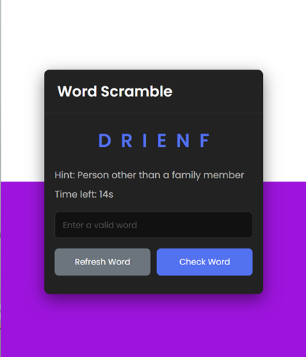

# Word Scramble Game

Welcome to the Word Scramble Game, a fun and challenging word puzzle game where you'll have to unscramble words to test your vocabulary skills.

## Table of Contents

- [Introduction](#introduction)
- [How to Play](#how-to-play)
- [Features](#features)
- [Getting Started](#getting-started)
- [Contributing](#contributing)
- [License](#license)

## Introduction

The Word Scramble Game is a web-based word puzzle game designed to entertain and educate. The game takes a random word, scrambles its letters, and challenges the player to unscramble the word. It's a great way to improve your vocabulary, spelling, and cognitive skills while having fun.

## How to Play

1. When you open the game, you will see a scrambled word on the screen.
2. Use your vocabulary skills to unscramble the word.
3. Type your answer in the input field.
4. You can also click the "Refresh Word" button to get a new scrambled word if you're stuck.
5. Once you think you've unscrambled the word, click the "Check Word" button to see if you're correct.
6. If your answer is correct, you'll receive positive feedback. If not, don't worry; you can keep trying!

## Features

- **Random Word Generation:** The game generates a random word for each round, providing endless fun and challenges.
- **Hint Feature:** Need a little help? Click the "Refresh Word" button to see a hint about the scrambled word.
- **Time Challenge:** You have a limited time to unscramble each word, adding an exciting time-bound element to the game.
- **Feedback:** Receive immediate feedback on whether your answer is correct.
- **Scoring:** Keep track of your score to challenge yourself to improve.
- **Educational:** Great for enhancing your vocabulary and cognitive skills.

## Getting Started

1. Clone or download the project repository.
2. Open the `index.html` file in your web browser to start playing.
3. Try to unscramble as many words as you can within the given time limit.
4. Have fun and improve your vocabulary!

## Contributing
We welcome contributions to the Word Scramble Game project. If you have ideas for improvements, new features, or bug fixes, please open an issue or submit a pull request. Let's make this game even better together!

## License
This project is licensed under the MIT License - see the LICENSE file for details.